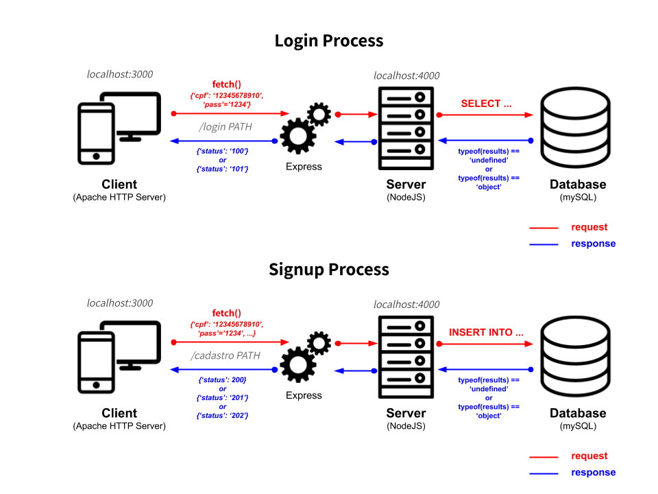

# Full-Stack Login Authentication Process
With this project I was able to learn my first back-end technologies, such as **NodeJS**, **Express**, **Nodemon**, **CORS**, etc. It was also an opportunity for me dive into the whole full-stack communication process (that includes HTTP requests, responses, POST and GET methods, JSON, AJAX, etc).

I could also use a relational database (in this case, **mySQL**) to store the data that would be used to validate my front-end form and **VIACEP**, a JSON API to autofill street names only by using a zipcode for signup.


## How it works
The scheme below can give you an overall idea about how communication flows between all parts.



## Response codes
Every time you send a request to the server, you'll get a JSON response code for your request. The response codes start with **1** if you were trying to login or **2** if you were trying to sign up.
#### Login
You'll get one of two different response codes from the server if you try to login. These are:
- **100**: if your credentials were authenticaded.
- **101**: if your credentials were **NOT** authenticated.
#### Signup
While signing up, you'll be able to receive one of three different response codes from the server. These are:
- **200**: if your signup was made sucessfully.
- **201**: if any error happened while trying to add you in the database.
- **202**: if you have already signed up before.


## How to run
You can run the server normally with **NodeJS** by using:
```
npm run start
```
It's also possible to run the server with **Nodemon** - who will keep track of all server files and restart it automatticaly if any changes are detected - by using:
```
npm run dev
```

## Changing the server port
You can change the server port by editing the serverPort constant on the client-side ('client/script.js:2') and on the server-side ('server/script.js:2').
#### Before:
```javascript
const serverPort = 4000;
```
#### After:
```javascript
const serverPort = 8080;
```
